# 🏛️ Narrative Vaults - Project Architecture Document

## Table of Contents

- [1. System Overview](#1-system-overview)
- [2. System Architecture](#2-system-architecture)
- [3. Component Breakdown](#3-component-breakdown)
- [4. Data Flow Diagrams](#4-data-flow-diagrams)
- [5. Sequence Diagrams](#5-sequence-diagrams)
- [6. Database Schema](#6-database-schema)
- [7. API Integration Specifications](#7-api-integration-specifications)
- [8. Backend Agent Logic](#8-backend-agent-logic)
- [9. Security & Risk Management](#9-security--risk-management)
- [10. Deployment Strategy](#10-deployment-strategy)

---

## 1. System Overview

Narrative Vaults is a gamified decentralized trading platform that allows users to participate in pair and basket trades based on market narratives without managing individual trading legs. It leverages three core protocols:

- **Pear Protocol**: For trade execution (pair/basket trading)
- **Hyperliquid**: Perpetual DEX for trade settlement
- **Salt Programmable Capital**: Policy-controlled vaults and risk management

### Key Features

- 🎮 **Gamified Trading**: XP system with level progression
- 🛡️ **Automated Risk Management**: Salt-powered policy enforcement
- ⚡ **Real-time Updates**: WebSocket-based live P&L tracking
- 📈 **Narrative-Based Trading**: Trade market themes, not individual tokens

---

## 2. System Architecture

### High-Level Architecture

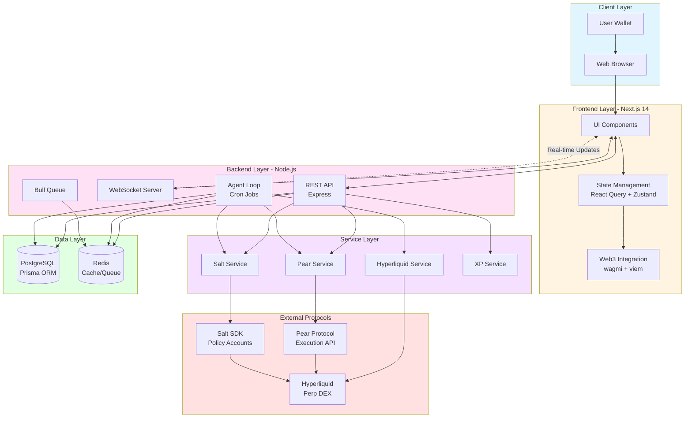

### Component Layer Diagram

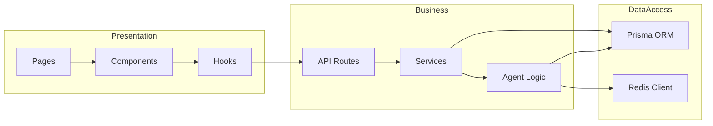

---

## 3. Component Breakdown

### 3.1. Frontend (Next.js 14, TypeScript)

**Stack:**
- Framework: Next.js 14 with App Router
- Language: TypeScript
- Styling: TailwindCSS
- Web3: wagmi + viem
- State Management:
  - Server State: React Query (TanStack Query)
  - Client State: Zustand
- Real-time: WebSocket client
- Charts: lightweight-charts

**Key Components:**

| Component | Purpose | Props |
|-----------|---------|-------|
| `VaultCard.tsx` | Display narrative vault info | `narrative`, `currentPnL`, `tvl`, `isLocked` |
| `XPProgressBar.tsx` | Visualize XP progress | `currentXP`, `currentLevel`, `nextLevelThreshold` |
| `LivePnLChart.tsx` | Real-time P&L chart | `vaultId`, `websocketEndpoint` |
| `DepositModal.tsx` | Handle deposits | `narrative`, `onDeposit`, `userBalance` |
| `WalletConnectButton.tsx` | Wallet connection | None |

**Pages:**
- `index.tsx`: Landing page with vault grid
- `dashboard.tsx`: User dashboard (XP, positions)
- `vault/[narrativeId].tsx`: Detailed vault view
- `leaderboard.tsx`: Top traders/vaults
- `how-it-works.tsx`: Educational content

### 3.2. Backend (Node.js, TypeScript)

**Stack:**
- Runtime: Node.js 20+
- Framework: Express.js
- Language: TypeScript
- Database: PostgreSQL with Prisma ORM
- Cache: Redis
- Queue: Bull (BullMQ)
- WebSocket: Socket.io / ws

**Service Modules:**

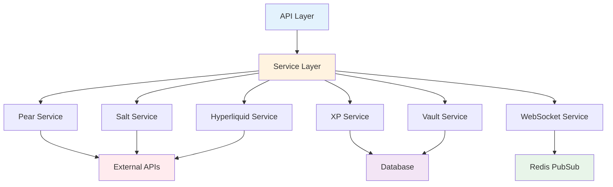

**Key Services:**

- **`pear.service.ts`**: Pear Protocol API integration
  - `executePair()`: Execute pair trades
  - `executeBasket()`: Execute basket trades
  - `getPosition()`: Fetch position status
  - `closePosition()`: Close active positions

- **`salt.service.ts`**: Salt SDK integration
  - `createVaultAccount()`: Create policy-controlled account
  - `executeTradeViaSalt()`: Execute trades through Salt
  - `checkRiskLimits()`: Verify policy compliance

- **`hyperliquid.service.ts`**: Hyperliquid monitoring
  - `getAssetPrices()`: Real-time price feeds
  - `monitorPosition()`: Position health monitoring
  - `emergencyLiquidation()`: Emergency actions

- **`xp.service.ts`**: Gamification logic
  - `calculateXP()`: XP calculation from trades
  - `awardXP()`: Award XP to users
  - `checkLevelUp()`: Level progression

### 3.3. Smart Contracts (HyperEVM)

**Minimal Contract Layer:**

1. **Vault Share Token (ERC-20)**
   - Represents proportional ownership in vaults
   - Standard ERC-20 interface
   - Mintable/Burnable by backend

2. **Emergency Pause Contract**
   - Admin-controlled circuit breaker
   - Halt deposits/withdrawals
   - Trigger mass liquidations

---

## 4. Data Flow Diagrams

### 4.1. User Deposit Flow

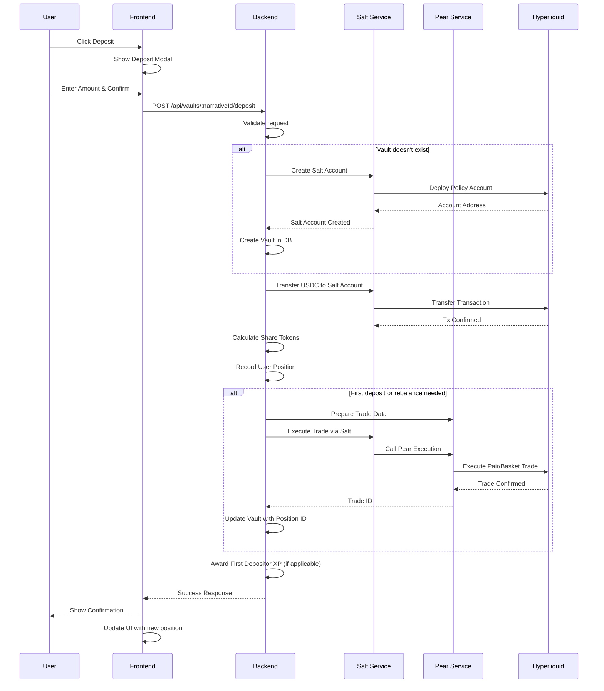

### 4.2. Agent Loop Flow

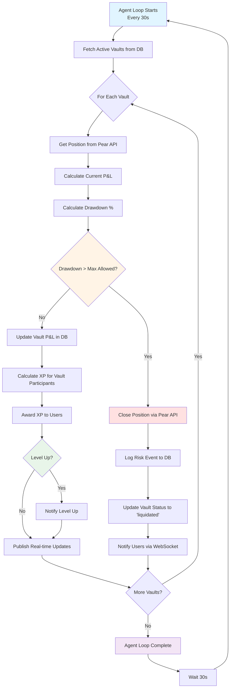

### 4.3. User Withdrawal Flow

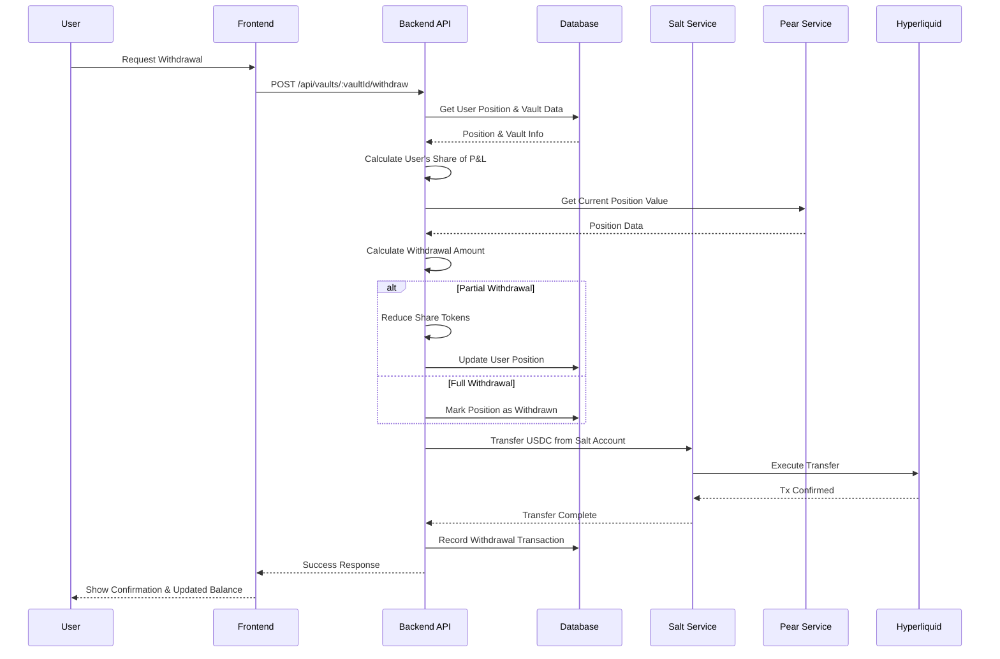

---

## 5. Sequence Diagrams

### 5.1. Complete Trading Lifecycle

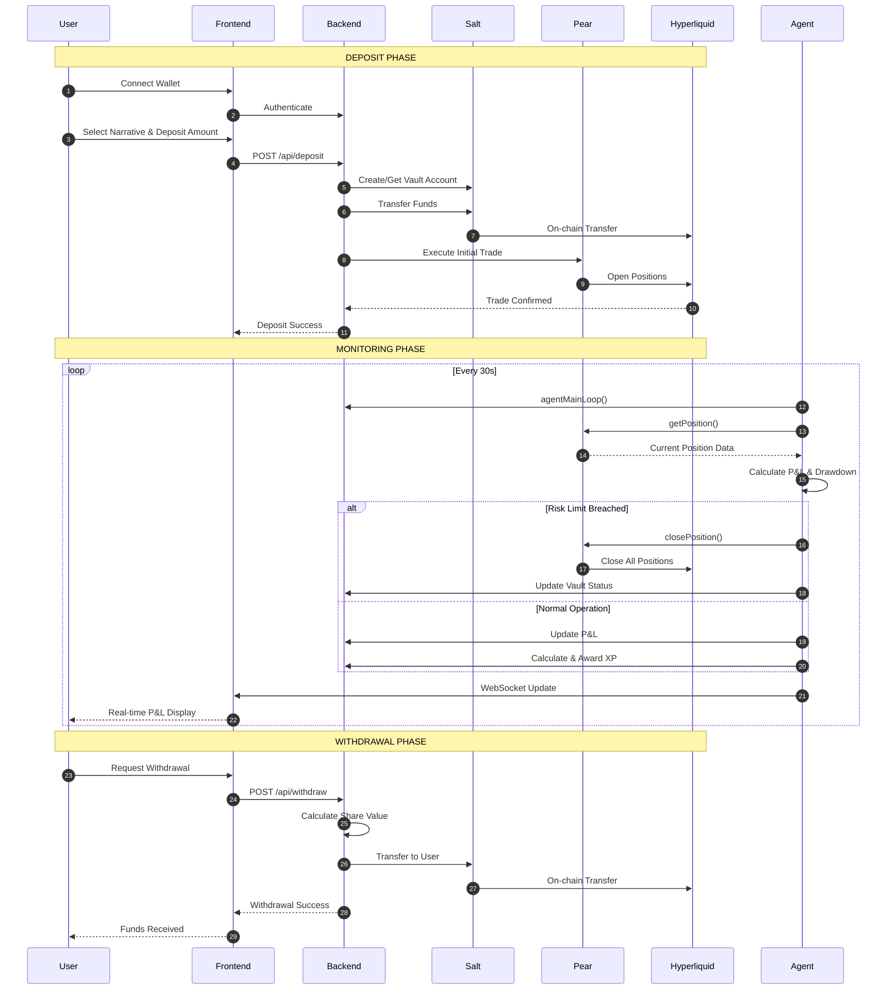

### 5.2. Risk Management Flow

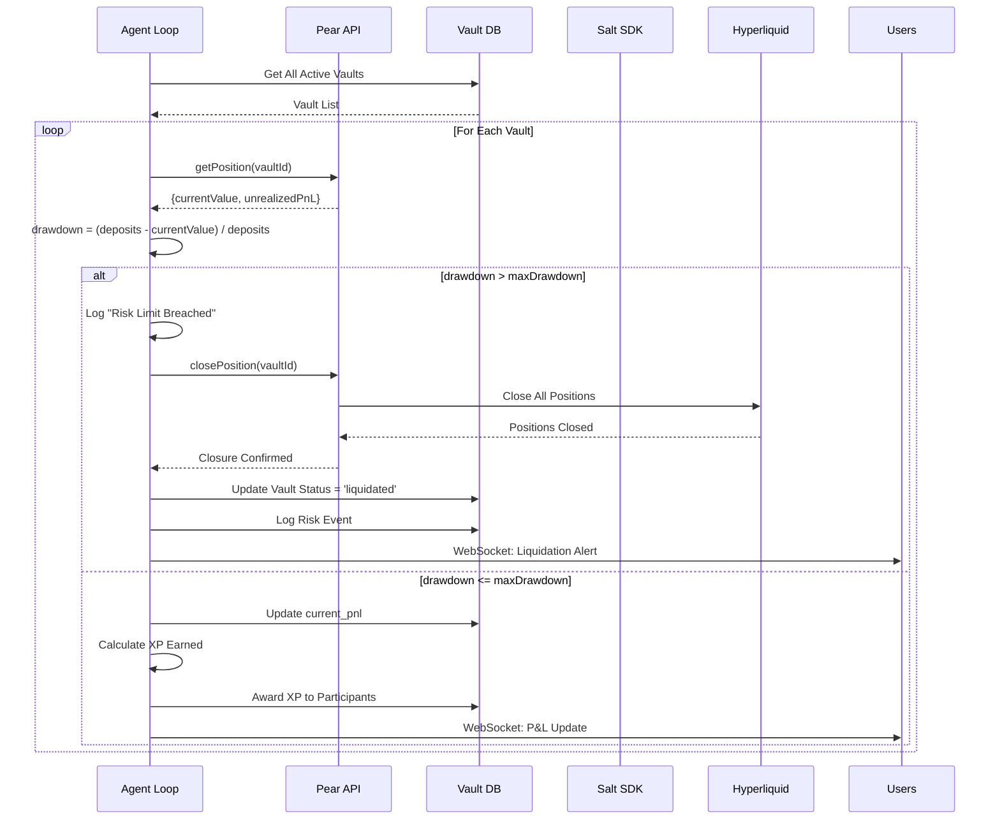

### 5.3. XP Award System Flow

```mermaid
flowchart LR
    A[Trade Profitable] --> B[Calculate PnL %]
    B --> C[XP = PnL% * 100]
    C --> D[Check Bonuses]
    
    D --> E{Daily Holding?}
    E -->|Yes| F[+10 XP/day]
    E -->|No| G{First Depositor?}
    
    F --> G
    G -->|Yes| H[+50 XP]
    G -->|No| I[Award Total XP]
    H --> I
    
    I --> J[Update User total_xp]
    J --> K{Level Up?}
    K -->|Yes| L[Increment Level]
    K -->|No| M[Publish XP Update]
    L --> N[Unlock New Narratives]
    N --> O[Notify User]
    O --> M
    
    style A fill:#e8f5e9
    style K fill:#fff3e0
    style L fill:#e1f5ff
```

---

## 6. Database Schema

### Entity Relationship Diagram

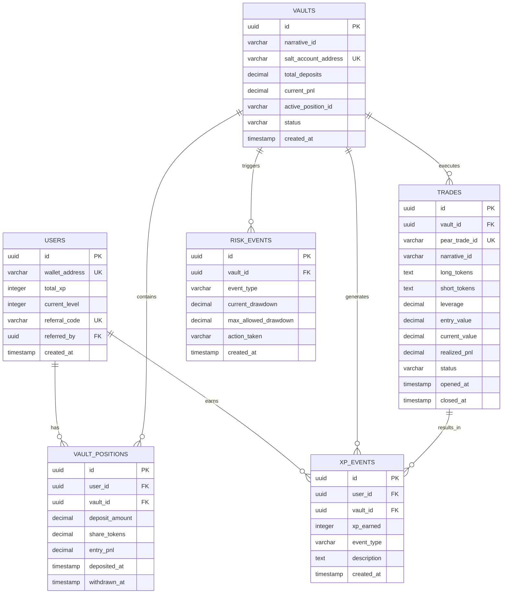

### Key Tables

**users**
- Stores user accounts with wallet addresses
- Tracks total XP and current level
- Supports referral system

**vaults**
- One vault per narrative (can be multiple if previous is liquidated)
- Links to Salt policy account
- Tracks total deposits and current P&L

**vault_positions**
- User's position in a specific vault
- Share token calculation for proportional ownership
- Tracks entry P&L for accurate gain/loss calculation

**trades**
- Records all executed trades via Pear Protocol
- Links to vault and stores Pear trade ID
- Tracks current value for P&L calculations

**xp_events**
- Ledger of all XP awarded
- Links to user and vault
- Categorizes by event type (trade_profit, daily_bonus, etc.)

**risk_events**
- Audit trail of all risk management actions
- Records drawdown levels and automated responses

---

## 7. API Integration Specifications

### 7.1. Pear Protocol Integration

**Base URL**: `https://api.pear.garden`  
**Authentication**: Client ID system (`HLHackathon1` through `HLHackathon10`)

#### Key Endpoints

**Execute Pair Trade**
```typescript
POST /api/v1/execute-pair

Request:
{
  clientId: string
  longAsset: string
  shortAsset: string
  longAmount: number
  leverage: number
  slippageTolerance: number
}

Response:
{
  tradeId: string
  status: 'pending' | 'executed'
  estimatedValue: number
}
```

**Execute Basket Trade**
```typescript
POST /api/v1/execute-basket

Request:
{
  clientId: string
  longBasket: Array<{asset: string, weight: number}>
  shortBasket: Array<{asset: string, weight: number}>
  totalValue: number
  leverage: number
}
```

**Get Position Status**
```typescript
GET /api/v1/position/{tradeId}

Response:
{
  tradeId: string
  status: 'open' | 'closed' | 'liquidated'
  currentValue: number
  unrealizedPnL: number
  longPositions: Array<{asset: string, quantity: number, entryPrice: number}>
  shortPositions: Array<{asset: string, quantity: number, entryPrice: number}>
}
```

**Close Position**
```typescript
POST /api/v1/close/{tradeId}

Response:
{
  tradeId: string
  closedValue: number
  realizedPnL: number
}
```

#### Error Handling

- Retry failed trades 3x with exponential backoff
- Queue trades locally if Pear API is down (using Bull)
- Abort and refund if slippage exceeds tolerance

### 7.2. Salt SDK Integration

**Core Functions:**

```typescript
// Create policy-controlled vault account
createVaultAccount(narrativeConfig: NarrativeConfig): Promise<string>

// Execute trade through Salt policy account
executeTradeViaSalt(vaultAddress: string, tradeData: string): Promise<string>

// Check if account complies with risk policies
checkRiskLimits(vaultAddress: string): Promise<{
  compliant: boolean
  currentDrawdown: number
  maxAllowed: number
}>

// Transfer funds to/from Salt account
transferToSaltAccount(address: string, amount: number): Promise<string>
transferFromSaltAccount(address: string, recipient: string, amount: number): Promise<string>
```

**Policy Configuration:**
```typescript
interface SaltPolicy {
  maxLeverage: number
  maxDrawdownPercent: number
  allowedProtocols: string[]
  emergencyAdmin: string
}
```

### 7.3. Hyperliquid API

**Network**: HyperEVM  
**Chain ID**: 998  
**RPC**: `https://rpc.hyperliquid.xyz/evm`

**Key Operations:**
- Get asset prices for P&L calculations
- Monitor position health via WebSocket
- Emergency liquidation (if necessary)

---

## 8. Backend Agent Logic

### Agent Main Loop (Every 30s)

```typescript
async function agentMainLoop() {
  const activeVaults = await db.vaults.findMany({ where: { status: 'active' } })
  
  for (const vault of activeVaults) {
    // 1. Get current position from Pear
    const position = await pearAPI.getPosition(vault.active_position_id)
    
    // 2. Calculate drawdown
    const drawdown = calculateDrawdown(vault.total_deposits, position.currentValue)
    
    // 3. Check risk limits
    const narrative = NARRATIVES[vault.narrative_id]
    if (drawdown > parseFloat(narrative.max_drawdown)) {
      // Policy breach - auto-liquidate
      await pearAPI.closePosition(vault.active_position_id)
      await db.risk_events.create({
        vault_id: vault.id,
        event_type: 'auto_liquidation',
        current_drawdown: drawdown,
        max_allowed_drawdown: narrative.max_drawdown,
        action_taken: 'closed_all_positions'
      })
      await db.vaults.update({
        where: { id: vault.id },
        data: { status: 'liquidated' }
      })
    }
    
    // 4. Update vault P&L
    await db.vaults.update({
      where: { id: vault.id },
      data: { current_pnl: position.unrealizedPnL }
    })
    
    // 5. Calculate and award XP
    await calculateAndAwardXP(vault, position)
    
    // 6. Publish real-time updates
    wsService.publish(`vault:${vault.id}`, {
      currentPnL: position.unrealizedPnL,
      drawdown
    })
  }
}

// Run every 30 seconds
setInterval(agentMainLoop, 30000)
```

### Deposit Handler

```typescript
async function handleUserDeposit(userId: string, narrativeId: string, depositAmount: number) {
  let vault = await db.vaults.findFirst({
    where: { narrative_id: narrativeId, status: 'active' }
  })
  
  // Create vault if doesn't exist
  if (!vault) {
    const narrative = NARRATIVES[narrativeId]
    const saltAccountAddress = await saltService.createVaultAccount(narrative)
    vault = await db.vaults.create({
      data: {
        narrative_id: narrativeId,
        salt_account_address: saltAccountAddress,
        total_deposits: 0
      }
    })
  }
  
  // Transfer USDC to Salt account
  await saltService.transferToSaltAccount(vault.salt_account_address, depositAmount)
  
  // Calculate share tokens
  const shareTokens = calculateShareTokens(vault, depositAmount)
  
  // Record position
  await db.vault_positions.create({
    data: {
      user_id: userId,
      vault_id: vault.id,
      deposit_amount: depositAmount,
      share_tokens: shareTokens
    }
  })
  
  // Update vault
  await db.vaults.update({
    where: { id: vault.id },
    data: { total_deposits: vault.total_deposits + depositAmount }
  })
  
  // Execute trade if needed
  if (!vault.active_position_id || shouldRebalance(vault)) {
    const tradeData = await pearService.prepareTradeData(vault, NARRATIVES[narrativeId])
    const txHash = await saltService.executeTradeViaSalt(vault.salt_account_address, tradeData)
    const tradeId = await pearService.getTradeIdFromTxHash(txHash)
    await db.vaults.update({
      where: { id: vault.id },
      data: { active_position_id: tradeId }
    })
  }
  
  // Award first depositor bonus
  const isFirstDeposit = await checkIfFirstDeposit(vault.id)
  if (isFirstDeposit) {
    await xpService.awardXP(userId, vault.id, 50, 'first_depositor_bonus')
  }
  
  return { vaultId: vault.id, shareTokens }
}
```

---

## 9. Security & Risk Management

### Security Measures

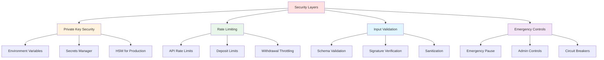

### Risk Management Strategies

1. **Salt Policy Enforcement**
   - Max leverage limits per narrative
   - Drawdown protection (10-20% max)
   - Allowed protocol whitelist

2. **Slippage Protection**
   - Configure max slippage (e.g., 2%)
   - Abort trades exceeding tolerance
   - Refund deposits minus gas

3. **API Failure Handling**
   - Circuit breakers for external APIs
   - Exponential backoff retries (3x max)
   - Local queue for offline periods

4. **Edge Cases**
   - **Partial Fills**: Scale position proportionally
   - **API Downtime**: Queue with Bull, notify users
   - **Vault Insolvency**: Freeze withdrawals, admin review
   - **Mid-Trade Withdrawal**: Calculate proportional P&L share

### Audit Trail

All critical events logged:
- Risk events (liquidations, policy breaches)
- XP awards and level-ups
- Deposits and withdrawals
- Trade executions

---

## 10. Deployment Strategy

### Infrastructure Diagram

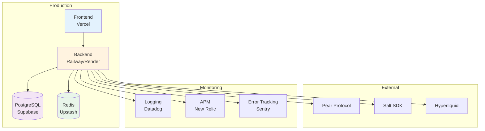

### Deployment Checklist

**Frontend (Vercel)**
- [x] Connect GitHub repository
- [x] Set root directory to `frontend/`
- [x] Configure environment variables
- [x] Enable automatic deployments

**Backend (Railway/Render)**
- [x] Connect GitHub repository
- [x] Set root directory to `backend/`
- [x] Provision PostgreSQL database
- [x] Provision Redis instance
- [x] Configure environment variables
- [x] Set build command: `npm run build`
- [x] Set start command: `npm start`
- [x] Configure cron job for agent loop

**Database (Supabase/Neon)**
- [x] Create PostgreSQL instance
- [x] Copy connection string
- [x] Run migrations: `npx prisma migrate deploy`
- [x] Seed initial data (optional)

### Environment Variables

**Backend:**
```bash
DATABASE_URL=postgresql://...
REDIS_URL=redis://...
HYPEREVM_RPC_URL=https://rpc.hyperliquid.xyz/evm
BACKEND_WALLET_PRIVATE_KEY=0x...
PEAR_API_BASE_URL=https://api.pear.garden
PEAR_CLIENT_ID=HLHackathon1
SALT_FACTORY_ADDRESS=0x...
ADMIN_ADDRESS=0x...
AGENT_LOOP_INTERVAL_MS=30000
```

**Frontend:**
```bash
NEXT_PUBLIC_API_URL=https://api.narrativevaults.xyz
NEXT_PUBLIC_WS_URL=wss://api.narrativevaults.xyz
NEXT_PUBLIC_WALLETCONNECT_PROJECT_ID=...
NEXT_PUBLIC_CHAIN_ID=998
```

### Monitoring & Alerts

- **Uptime**: Pingdom / UptimeRobot
- **Errors**: Sentry for error tracking
- **Performance**: New Relic APM
- **Logs**: Datadog / CloudWatch
- **Alerts**: PagerDuty for critical issues

### Backup Strategy

- **Database**: Daily automated backups
- **Redis**: Persistence enabled with AOF
- **Code**: Git-based version control
- **Secrets**: Stored in secure vault

---

## Conclusion

This architecture document provides a comprehensive overview of the Narrative Vaults platform, including:

✅ High-level and detailed system architecture  
✅ Component breakdown with clear responsibilities  
✅ Multiple diagram types (flow, sequence, ER, deployment)  
✅ Complete API integration specifications  
✅ Database schema with relationships  
✅ Security and risk management strategies  
✅ Deployment guide with checklists  

The platform leverages modern web technologies, blockchain integrations, and automated risk management to create a unique gamified trading experience.

---

**For additional documentation:**
- [API Documentation](API_DOCS.md)
- [Setup Guide](../README.md#getting-started)
- [Contributing Guidelines](../CONTRIBUTING.md)

**Built with ❤️ for ETH Denver 2026**
